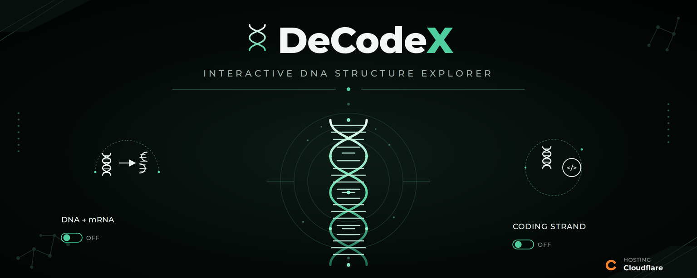

  

# 🧬 DeCodeX

### *Interactive DNA Structure Explorer*

> **DeCodeX** is an interactive visualization exploring **DNA structure**, base pairing, hydrogen bonding, and transcription through a B-form double helix.
>
🧬 **DNA Structure** · 🧪 **Base Pairing** · 🧬 **Transcription**

**🔬 [Explore the Simulation](https://decodex.dray-ashcroft.workers.dev)**

---

## ✦ Features

**🧬 3D Helix Explorer**  
Explore an interactive B-form DNA double helix.

**🧪 Base Pair Analysis**  
Inspect A–T and G–C base pairs and their hydrogen bonding.

**📊 mRNA Mode**  
Visualize DNA-to-mRNA transcription.

**🔄 Strand Toggle**  
Switch between coding and template strands.

**📚 Educational Visualization**  
Explore molecular genetics through interactive visualization.

---

## 🧬 Core Concepts

**B-Form DNA · A–T Pairing · G–C Pairing · Hydrogen Bonding · Transcription**

---

## ⚙️ Technology

**HTML · CSS · JavaScript**

**Repository:** GitHub & Codeberg  
**Hosting:** Cloudflare

---

## 📜 License

Distributed under the **GNU General Public License v3.0 (GPL-3.0)**.
